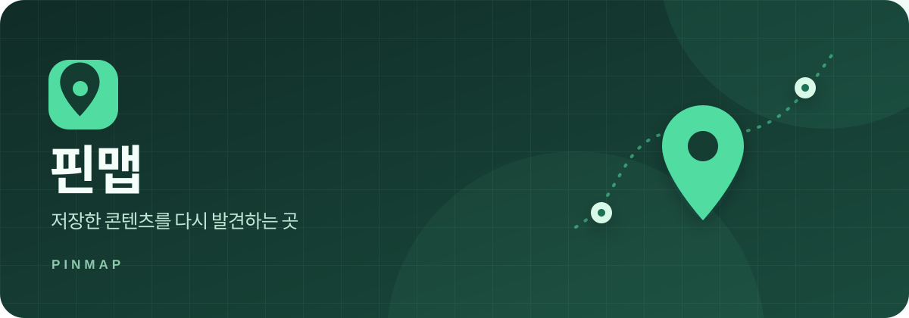

  

  # 핀맵 · pinmap

  **저장만 하고 잊어버린 콘텐츠를, 필요한 순간 다시 발견할 수 있도록.**

  [프로토타입 체험하기](https://pinmap-prototype.vercel.app/) · [Figma 디자인](https://www.figma.com/design/LdXCdWJrA53sBN9aBgQEDy/?node-id=365-52)

## 프로젝트 소개

맛집, 전시, 여행지부터 쇼핑과 생활 정보까지. SNS나 웹에서 저장한 콘텐츠는 쌓이기 쉽지만 다시 찾기는 어렵습니다. **핀맵**은 흩어진 저장 콘텐츠를 한곳에서 정리하고, 관심사와 상황에 맞춰 다시 꺼내 보도록 돕는 서비스입니다.

장소 정보는 지도에서 탐색하고, 그 밖의 콘텐츠는 저장함에서 검색·분류해 찾아볼 수 있습니다.

## 주요 경험

| 저장하기 | 다시 찾기 | 활용하기 |
| --- | --- | --- |
| 링크를 붙여넣거나 공유 흐름으로 콘텐츠를 저장합니다. | 카테고리, 저장목록 검색, 관심사별 홈과 지도로 살펴봅니다. | 저장한 장소로 날짜별 코스를 계획하고, 외부 지도에서 길찾기로 이어집니다. |

## 현재 진행 상태

**웹 프로토타입을 검증 중이며, 목표는 iOS·Android 앱 출시입니다.** 지금 공개된 버전에서는 체험용 로그인, 콘텐츠 저장·수정, 저장목록 검색, 실제 지도 배경에서 예시 장소 탐색, 날짜별 코스 계획 등을 체험할 수 있습니다.

지도 배경은 OpenStreetMap을 사용하지만 장소 정보는 예시 데이터입니다. 현재 로그인, SNS 공유 화면, AI 분류, 위치·거리, 앱 밖 알림은 사용 흐름을 확인하기 위한 **시뮬레이션**입니다. 실제 SNS 연동, AI 분석, GPS, 푸시 알림과 계정 간 동기화는 아직 연결되지 않았습니다.

## 코드와 배포

| 용도 | 위치 |
| --- | --- |
| 공개 웹 프로토타입 | [pinmap-prototype.vercel.app](https://pinmap-prototype.vercel.app/) |
| 웹 프로토타입 원본 코드 | [pinmap-web-prototype](https://github.com/pinmap-team/pinmap-web-prototype) · 공개 저장소 |
| 앱 실험 및 출시 개발 코드 | [pinmap](https://github.com/pinmap-team/pinmap) · 팀원용 비공개 저장소 |

웹 프로토타입은 GitHub의 `pinmap-web-prototype` 저장소와 Vercel 프로젝트 `pinmap-prototype`이 연결되어 있습니다. 팀원은 작업 브랜치에서 수정하고 Pull Request로 검토한 뒤 `main`에 합칩니다. `main`에 올라간 변경은 Vercel에서 자동 배포되며, 공개 주소는 그대로 유지됩니다.

## 팀 소개

핀맵은 **3명의 대학생 디자이너**가 사용자 조사부터 경험 설계, 화면 디자인, 프로토타입 검증까지 함께 만드는 프로젝트입니다. 사용자에게 필요한 핵심 흐름을 검증하며 출시 가능한 앱으로 발전시키고 있습니다.

| 팀원 | GitHub |
| --- | --- |
| 신서윤 | [@ssiissymhnn](https://github.com/ssiissymhnn) |
| 이세은 | [@wowseen-sketch](https://github.com/wowseen-sketch) |
| 정지현 | [@stophyun02](https://github.com/stophyun02) |

## 작업 도구

- **디자인·프로토타입:** Figma
- **현재 구현:** HTML, CSS, JavaScript 기반 모바일 웹 프로토타입
- **코드·작업 관리:** GitHub
- **웹 프로토타입 배포:** Vercel (GitHub `main` 브랜치 자동 배포)
- **출시 목표:** iOS·Android 앱 (구현 방식은 검토 중)

## 프로젝트 살펴보기

- [웹 프로토타입 체험](https://pinmap-prototype.vercel.app/)
- [Figma 디자인 파일](https://www.figma.com/design/LdXCdWJrA53sBN9aBgQEDy/?node-id=365-52)
- [웹 프로토타입 코드와 수정 방법](https://github.com/pinmap-team/pinmap-web-prototype)
- [앱 실험 및 출시 개발 코드](https://github.com/pinmap-team/pinmap) — 비공개 저장소이며, 접근 권한이 있는 팀원만 볼 수 있습니다.

핀맵은 현재 개발·검증 단계이며, 공개 프로토타입의 데이터는 각 방문자의 브라우저에 저장됩니다.
